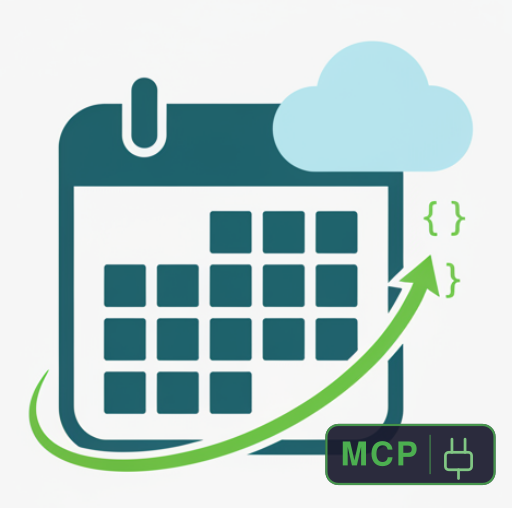

<p align="center">
  
</p>

<h1 align="center">iCloud Calendar MCP Server</h1>

[](https://github.com/icloud-calendar-mcp/icloud-calendar-mcp/actions/workflows/test.yml)
[](https://www.npmjs.com/package/@icloud-calendar-mcp/server)
[](https://pypi.org/project/icloud-calendar-mcp/)
[](LICENSE)
[](https://registry.modelcontextprotocol.io/?search=org.onekash)
[](#testing)
[](#security)

An MCP (Model Context Protocol) server that gives AI assistants access to iCloud Calendar via CalDAV, with security controls aligned with the [OWASP MCP Top 10](https://owasp.org/www-project-mcp-top-10/).

> [!CAUTION]
> **Never use your main Apple ID password.** This server requires an [app-specific password](https://support.apple.com/en-us/HT204397) which can be revoked independently without affecting your Apple ID.

## Why this server

- **Portable CalDAV.** Runs anywhere a JVM runs. It does not depend on macOS, AppleScript, or Calendar.app.
- **Durable event handles.** `get_events` and `create_event` return an opaque `handle` that references an event across sessions and process restarts, so editing or deleting one needs no re-listing.
- **Correct recurrence.** A series expands into one result per occurrence in the range, and you can edit or delete a single occurrence, this-and-future, or the whole series.
- **Bounded responses.** Date-span and event-count caps return a clear, structured error instead of a silently truncated response.
- **Security aligned with the OWASP MCP Top 10**, backed by a dedicated test suite.
- **Published on the MCP Registry, npm, and PyPI.**

## Features

### MCP Tools

| Tool | Description | Read-Only | Destructive |
|------|-------------|:---------:|:-----------:|
| `list_calendars` | List all calendars from iCloud account | Yes | No |
| `get_events` | Get events within a date range from a calendar | Yes | No |
| `create_event` | Create a new calendar event | No | No |
| `update_event` | Update an event (whole series or a single occurrence) | No | No |
| `delete_event` | Delete an event (whole series or a single occurrence) | No | Yes |

### MCP Resources

| Resource | Description |
|----------|-------------|
| `calendar://calendars` | Browse available calendars |

### MCP Prompts

User-initiated templates that guide Claude through a multi-step task:

| Prompt | Description |
|--------|-------------|
| `schedule_meeting` | Draft an event from a title, attendees, and duration, then create it |
| `reschedule` | Move an existing event by looking it up, then editing it |
| `find_conflicts` | List a day's events and report overlapping time slots |

### Security Features

- **Credential Protection** - Environment variables only, never in code or config
- **Input Validation** - All parameters validated with SSRF protection
- **Rate Limiting** - 60 reads/min, 20 writes/min per MCP specification
- **Secure Error Handling** - No sensitive data leakage in error messages
- **OWASP MCP Top 10 Compliance** - 282 security tests covering all major risks
- **ReDoS Protection** - All regex patterns tested against catastrophic backtracking
- **Unicode Security** - Protection against homoglyph and encoding attacks

---

## Quick Start

### Prerequisites

- **Java 21+** (for all installation methods)
- iCloud account with [app-specific password](https://support.apple.com/en-us/HT204397)

### Installation

Choose your preferred installation method:

> [!IMPORTANT]
> Every option runs the same Java build. **Java 21 or newer must be on your `PATH`, including for `npx` and `uvx`.** Those wrappers download and launch the JAR; they do not replace the JVM.

#### Option 1: npm (Recommended)

```bash
npx @icloud-calendar-mcp/server
```

#### Option 2: Python (uvx)

```bash
uvx icloud-calendar-mcp
```

#### Option 3: Direct JAR

```bash
# Download the latest release (version-agnostic name, always resolves)
curl -LO https://github.com/icloud-calendar-mcp/icloud-calendar-mcp/releases/latest/download/icloud-calendar-mcp-all.jar

# Run
java -jar icloud-calendar-mcp-all.jar
```

#### Option 4: Build from Source

```bash
git clone https://github.com/icloud-calendar-mcp/icloud-calendar-mcp.git
cd icloud-calendar-mcp
./gradlew fatJar
java -jar build/libs/icloud-calendar-mcp-*-all.jar
```

### Configuration

Set your iCloud credentials as environment variables:

```bash
export ICLOUD_USERNAME="your-apple-id@icloud.com"
export ICLOUD_PASSWORD="your-app-specific-password"
```

> **Security Note**: Use an [app-specific password](https://support.apple.com/en-us/HT204397), not your main Apple ID password.

---

## Claude Desktop Integration

Add to your Claude Desktop configuration:

| Platform | Config Path |
|----------|-------------|
| macOS | `~/Library/Application Support/Claude/claude_desktop_config.json` |
| Linux | `~/.config/claude/claude_desktop_config.json` |
| Windows | `%APPDATA%\Claude\claude_desktop_config.json` |

<details open>
<summary><strong>Using npm (Recommended)</strong></summary>

```json
{
  "mcpServers": {
    "icloud-calendar": {
      "command": "npx",
      "args": ["@icloud-calendar-mcp/server"],
      "env": {
        "ICLOUD_USERNAME": "your-apple-id@icloud.com",
        "ICLOUD_PASSWORD": "your-app-specific-password"
      }
    }
  }
}
```
</details>

<details>
<summary><strong>Using uvx (Python)</strong></summary>

```json
{
  "mcpServers": {
    "icloud-calendar": {
      "command": "uvx",
      "args": ["icloud-calendar-mcp"],
      "env": {
        "ICLOUD_USERNAME": "your-apple-id@icloud.com",
        "ICLOUD_PASSWORD": "your-app-specific-password"
      }
    }
  }
}
```
</details>

<details>
<summary><strong>Using JAR directly</strong></summary>

```json
{
  "mcpServers": {
    "icloud-calendar": {
      "command": "java",
      "args": ["-jar", "/path/to/icloud-calendar-mcp-all.jar"],
      "env": {
        "ICLOUD_USERNAME": "your-apple-id@icloud.com",
        "ICLOUD_PASSWORD": "your-app-specific-password"
      }
    }
  }
}
```
</details>

---

## Usage Examples

Once configured, you can ask Claude:

- *"What's on my calendar this week?"*
- *"Create a meeting with John tomorrow at 2pm"*
- *"Show me all my calendars"*
- *"Delete the dentist appointment on Friday"*
- *"Move my 3pm meeting to 4pm"*

### Tool Parameters

#### list_calendars
No parameters required.

#### get_events
| Parameter | Type | Required | Description |
|-----------|------|----------|-------------|
| `calendar_id` | string | Yes | Calendar identifier (from `list_calendars`) |
| `start_date` | string | Yes | Start date (`YYYY-MM-DD`) |
| `end_date` | string | Yes | End date (`YYYY-MM-DD`) |

Behavior to know about:

- **UTC day boundaries.** `start_date` and `end_date` select whole UTC calendar days: `start_date` at 00:00 UTC through the end of `end_date` in UTC. Timed events return UTC `startTime`/`endTime` instants; all-day events return a plain `YYYY-MM-DD`. To resolve a user's day in another timezone, request one extra day on each side and keep the events whose start, converted to that zone, falls on the wanted day; all-day events are floating dates and need no conversion.
- **Limits.** The range is capped at 366 days, and `end_date` must not precede `start_date`. The response is capped at 1000 events, and a single recurring series that expands to too many occurrences is rejected. If you hit a cap, query a week or a month at a time.
- **Recurring series.** Each occurrence in the range is returned as its own result, carrying its own `handle` and a `recurrenceId` that identifies the instance.
- **Read-after-write.** iCloud does not guarantee immediate visibility, so an event created moments ago can be missing from the next `get_events` for a short window. This is CDN indexing lag, not a deletion, so do not recreate it.

Each result includes `uid`, `handle`, `summary`, `isAllDay`, and `startTime`/`endTime` (timed) or `startDate`/`endDate` (all-day), plus any of `description`, `location`, `rrule`, `recurrenceId`, `status`, `url`, `categories`, `priority`, `organizer`, `attendeeCount` that are set.

#### create_event
| Parameter | Type | Required | Description |
|-----------|------|----------|-------------|
| `calendar_id` | string | Yes | Target calendar |
| `title` | string | Yes | Event title |
| `start_time` | string | Cond. | ISO 8601 datetime for a timed event. A naive value (`2026-01-15T09:00:00`) is read as UTC unless `timezone` is set; a `Z` or offset value is an absolute instant that overrides `timezone` |
| `end_time` | string | Cond. | ISO 8601 datetime for a timed event (same rules as `start_time`) |
| `start_date` | string | Cond. | Start date `YYYY-MM-DD` for an all-day event |
| `end_date` | string | Cond. | End date `YYYY-MM-DD`, inclusive, for an all-day event |
| `is_all_day` | boolean | No | All-day event flag |
| `description` | string | No | Event description |
| `location` | string | No | Event location |
| `timezone` | string | No | IANA timezone for a timed event (e.g., `America/New_York`) |
| `end_timezone` | string | No | IANA timezone for the end when it differs from the start (e.g., a flight). Falls back to `timezone` |
| `rrule` | string | No | Recurrence rule (e.g., `FREQ=WEEKLY;BYDAY=MO`) |
| `rdates` | string[] | No | Extra occurrence dates (RFC 5545 RDATE) |
| `exdates` | string[] | No | Excluded occurrence dates (RFC 5545 EXDATE) |
| `alarms` | object[] | No | Reminders on the event (see [Alarms](#alarms)) |

#### update_event
Only the fields you pass are changed.

| Parameter | Type | Required | Description |
|-----------|------|----------|-------------|
| `event_id` | string | Yes | Reference to the event. Prefer the opaque `handle` from `get_events`/`create_event`; a bare UID also works for an event fetched earlier in the session (see [Referencing an event](#referencing-an-event)) |
| `title` | string | No | New title |
| `start_time` | string | No | New start time (ISO 8601, same rules as create) |
| `end_time` | string | No | New end time (ISO 8601) |
| `start_date` | string | No | New start date for an all-day event (`YYYY-MM-DD`) |
| `end_date` | string | No | New end date for an all-day event (`YYYY-MM-DD`) |
| `is_all_day` | boolean | No | Change to all-day event |
| `description` | string | No | New description |
| `location` | string | No | New location |
| `timezone` | string | No | IANA timezone (e.g., `America/New_York`) |
| `end_timezone` | string | No | IANA timezone for the end when it differs from the start |
| `rrule` | string | No | Recurrence rule |
| `rdates` | string[] | No | Replace RDATEs (omit to keep, empty array to clear) |
| `exdates` | string[] | No | Replace EXDATEs (omit to keep, empty array to clear) |
| `alarms` | object[] | No | Replace reminders (omit to keep, empty array to clear, a list to replace; see [Alarms](#alarms)) |
| `scope` | string | Cond. | Which occurrences a recurring edit affects (see [Editing recurring events](#editing-recurring-events)). Required when the handle points at one occurrence of a series |

#### delete_event
| Parameter | Type | Required | Description |
|-----------|------|----------|-------------|
| `event_id` | string | Yes | Reference to the event. Prefer the opaque `handle`; a bare UID also works for an event fetched earlier in the session |
| `scope` | string | Cond. | Which occurrences a recurring delete removes (see [Editing recurring events](#editing-recurring-events)). Required when the handle points at one occurrence of a series |

### Referencing an event

`get_events` and `create_event` return two identifiers for each event: a `uid` and an opaque `handle`. Pass the `handle` to `update_event` and `delete_event`. It is self-contained and works from a fresh process, so the normal flow is `get_events` (or `create_event`) to obtain the handle, then `update_event`/`delete_event` with it. No extra lookup step is needed across sessions.

A bare `uid` is also accepted, but only for an event fetched earlier in the same session, where it resolves through a short-lived in-memory cache. There is no stateless server-side lookup by UID: iCloud rejects a CalDAV `calendar-query` UID `prop-filter` (HTTP 412), and an unfiltered query would return the whole calendar. Prefer the handle.

A handle carries the event's ETag. If the event changed elsewhere since the handle was issued, the edit reports a conflict rather than overwriting the newer version; re-run `get_events` for a fresh handle and retry. On success, `update_event` returns a refreshed handle carrying the new ETag, so use that one for the next edit in a chain.

### Editing recurring events

`get_events` returns one result per occurrence of a recurring series, each with its own `handle`. When you edit or delete an occurrence handle, set `scope`:

- `this_occurrence`: change or cancel only that instance.
- `this_and_future`: that instance and every later one.
- `all_events`: the whole series.

`scope` is required when the handle points at one occurrence of a series. The operation is rejected without it, so a single-occurrence edit never changes the whole series by accident. Omit `scope` for standalone events. `rrule`, `rdates`, and `exdates` cannot be combined with `this_occurrence` or `this_and_future`.

### Alarms

`create_event` and `update_event` take an `alarms` array. Each entry is an object:

| Field | Required | Description |
|-------|----------|-------------|
| `trigger` | Yes | Relative duration (`-PT15M`, `-P1D`) or an absolute UTC instant (`20260115T093000Z`) |
| `action` | No | `DISPLAY` (default), `AUDIO`, or `EMAIL` |
| `description` | No | Alarm text (defaults to "Reminder" for `DISPLAY`) |
| `summary` | No | Subject line, `EMAIL` only |
| `repeat_count` | No | Number of times to repeat |
| `repeat_duration` | No | Gap between repeats (RFC 5545 duration) |

On `update_event`, omit `alarms` to keep the existing ones, pass an empty array to clear them, or pass a list to replace them.

---

## Troubleshooting

**A new event does not appear right away.** iCloud does not guarantee immediate visibility, so a just-created event can be missing from the next `get_events` for a short window (CDN indexing lag). The `create_event` success response is authoritative. Do not recreate the event.

**`get_events` returns a size or count error.** The range is too wide. Query a week or a month at a time; the response is capped at 1000 events.

**Authentication fails.** Use an [app-specific password](https://support.apple.com/en-us/HT204397), not your Apple ID password, and set `ICLOUD_USERNAME` to your full iCloud email address.

**Not sure which `calendar_id` to use.** Call `list_calendars` and use the `id` of the calendar you want.

**A recurring edit was rejected or changed every instance.** Set `scope` (see [Editing recurring events](#editing-recurring-events)): an occurrence handle needs `this_occurrence`, `this_and_future`, or `all_events`.

**Times look shifted by your timezone.** `get_events` uses UTC day boundaries (see [get_events](#get_events)). Pass `timezone` when creating timed events, and use the extra-day approach to resolve a local day.

---

## Security

This server is designed with security as a primary concern, following the [OWASP MCP Top 10](https://owasp.org/www-project-mcp-top-10/) guidelines.

### Privacy

The server talks only to your machine (over STDIO) and to iCloud (`caldav.icloud.com`). It has no telemetry and sends your calendar data nowhere else. Credentials come from environment variables and are never logged.

### Security Controls

| Control | Implementation |
|---------|----------------|
| **Credential Storage** | Environment variables only, never logged or exposed |
| **Input Validation** | All inputs validated (calendar IDs, dates, times, text fields) |
| **SSRF Protection** | Blocks internal IPs, localhost, and dangerous URI schemes |
| **Rate Limiting** | Sliding window: 60 reads/min, 20 writes/min |
| **Error Handling** | Passwords, tokens, paths, emails sanitized from errors |
| **Injection Prevention** | ICS content properly escaped, command injection tested |
| **ETag Normalization** | RFC 7232 compliant, strips quotes/W/ prefix/XML entities |
| **Content-Length Guard** | Early rejection of oversized responses before buffering |
| **Circuit Breaker** | Prevents cascading failures with automatic recovery |
| **Audit Logging** | CUD operations logged via MCP logging protocol (MCP08) |
| **ReDoS Protection** | All regex patterns tested for catastrophic backtracking |
| **Unicode Security** | Homoglyph, normalization, and encoding bypass protection |

### OWASP MCP Top 10 Coverage

| Risk | Mitigation | Tests |
|------|------------|-------|
| **MCP01: Token Mismanagement** | Credentials masked in logs/errors, secure storage | 14 |
| **MCP02: Privilege Escalation** | Fixed tool set, no dynamic registration | 5 |
| **MCP03: Tool Argument Injection** | Input validation, parameterized operations | 8 |
| **MCP04: Sensitive Data Exposure** | Error sanitization, credential masking | 10 |
| **MCP05: Command Injection** | Input treated as data, not executed | 3 |
| **MCP06: Prompt Injection** | Malicious text stored as data, not interpreted | 3 |
| **MCP08: Insecure Logging** | Rate limiting, sensitive data sanitization | 31 |
| **MCP09: Resource Exhaustion** | Rate limiting, input size limits, DoS protection | 25 |
| **MCP10: Context Over-sharing** | Isolated state, no cross-request data leakage | 3 |

See [SECURITY.md](SECURITY.md) for full security documentation and vulnerability disclosure process.

---

## Testing

Tests live in two places: the MCP server module and the vendored `icaldav-core`
iCalendar library. Both run with:

```bash
./gradlew test
```

### Test Coverage (MCP server)

| Category | Tests | Description |
|----------|-------|-------------|
| **Security** | 282 | Adversarial inputs, OWASP MCP Top 10, ReDoS, Unicode |
| **CalDAV Protocol** | 181 | XML parsing, HTTP client, models, ETag normalization |
| **ICS Format** | 150 | RFC 5545 parsing, building, patching |
| **Error Handling** | 56 | Secure error responses, credential sanitization |
| **Integration** | 45 | End-to-end tools, MCP spec compliance, annotations |
| **Input Validation** | 44 | All parameter validation rules |
| **Service Layer** | 26 | Calendar operations, caching |
| **Rate Limiting** | 18 | Concurrent access, window reset |
| **Cancellation** | 12 | Operation cancellation, cleanup |
| **Logging** | 9 | MCP logging compliance |
| **Progress** | 9 | Progress reporting |
| **E2E** | 11 | Live CalDAV + end-to-end integration |

### Security Test Categories

| Category | Tests | Coverage |
|----------|-------|----------|
| **Adversarial Inputs** | 53 | SQL/NoSQL injection, XSS, path traversal |
| **ICS Patcher Security** | 43 | CRLF injection, property injection, encoding attacks |
| **Unicode Security** | 38 | Homoglyphs, normalization, RTL override |
| **Logger Security** | 31 | Log injection, credential sanitization |
| **OWASP MCP Risks** | 29 | MCP01-10 specific attack vectors |
| **Progress Security** | 27 | Token enumeration, injection |
| **ReDoS Protection** | 25 | Catastrophic backtracking, resource exhaustion |
| **Cancellation Security** | 22 | Replay attacks, race conditions |
| **Credential Security** | 14 | Token masking, secure storage |

### Running Specific Tests

```bash
# All tests
./gradlew test

# Security tests only
./gradlew test --tests "*SecurityTest*"
./gradlew test --tests "AdversarialTest"

# OWASP MCP specific tests
./gradlew test --tests "OwaspMcpSecurityTest"

# Unicode security tests
./gradlew test --tests "UnicodeSecurityTest"

# ReDoS protection tests
./gradlew test --tests "ReDoSSecurityTest"

# CalDAV tests
./gradlew test --tests "*CalDav*"

# ICS tests
./gradlew test --tests "*Ics*"
```

---

## Architecture

```
+------------------------------------------------------------------+
|                    MCP Server (STDIO Transport)                    |
|                                                                    |
|  +----------------+  +----------------+  +----------------------+  |
|  | Rate Limiter   |  |   Input        |  |  Secure Error        |  |
|  | 60r/20w/min    |  |  Validator     |  |  Handler             |  |
|  +----------------+  +----------------+  +----------------------+  |
|                                                                    |
|  +----------------+  +----------------+  +----------------------+  |
|  | MCP Logger     |  | Cancellation   |  |  Progress            |  |
|  | (RFC 5424)     |  | Manager        |  |  Reporter            |  |
|  +----------------+  +----------------+  +----------------------+  |
|                                                                    |
|  Tools: list_calendars | get_events | create_event |               |
|         update_event | delete_event                                |
|                                                                    |
|  Resources: calendar://calendars                                   |
+------------------------------------------------------------------+
                              |
                              v
+------------------------------------------------------------------+
|                      CalendarService                               |
|  Orchestrates CalDAV operations, caches calendar metadata          |
+------------------------------------------------------------------+
                              |
                              v
+------------------------------------------------------------------+
|                      CalDAV Client Layer                           |
|                                                                    |
|  +-------------------+  +-------------------+  +----------------+  |
|  | OkHttpCalDav      |  |  IcsParser        |  |  IcsBuilder    |  |
|  | Client            |  |  (icaldav-core)   |  |  (icaldav-core)|  |
|  +-------------------+  +-------------------+  +----------------+  |
|                                                                    |
|  +-------------------+  +-------------------+  +----------------+  |
|  | ICloudXml         |  |  IcsPatcher       |  |  EtagUtils     |  |
|  | Parser            |  |  (event edits)    |  |  (RFC 7232)    |  |
|  +-------------------+  +-------------------+  +----------------+  |
|                                                                    |
|  +-------------------+                                             |
|  | Credential        |                                             |
|  | Manager           |                                             |
|  +-------------------+                                             |
+------------------------------------------------------------------+
                              |
                              v
+------------------------------------------------------------------+
|                    iCloud CalDAV API                               |
|                    caldav.icloud.com                               |
+------------------------------------------------------------------+
```

---

## Development

### Build

```bash
# Build
./gradlew build

# Build fat JAR
./gradlew fatJar

# Run tests
./gradlew test

# Clean build
./gradlew clean build
```

### Project Structure

```
src/main/kotlin/org/onekash/mcp/calendar/
├── Main.kt                 # MCP server entry point
├── caldav/                 # CalDAV protocol implementation
│   ├── CalDavClient.kt     # Client interface
│   ├── CalDavModels.kt     # Domain models
│   ├── OkHttpCalDavClient.kt
│   ├── ICloudXmlParser.kt
│   └── EtagUtils.kt        # RFC 7232 ETag normalization
├── ics/                    # ICS format handling (via icaldav-core)
│   ├── IcsParser.kt        # Parse iCalendar data
│   ├── IcsBuilder.kt       # Generate iCalendar data
│   └── IcsPatcher.kt       # Patch existing events (CRLF-safe)
├── service/                # Business logic
│   └── CalendarService.kt  # CalDAV orchestration + event cache
├── security/               # Security controls
│   └── CredentialManager.kt
├── validation/             # Input validation
│   └── InputValidator.kt
├── error/                  # Error handling
│   └── SecureErrorHandler.kt
├── ratelimit/              # Rate limiting
│   └── RateLimiter.kt
├── logging/                # MCP logging
│   └── McpLogger.kt
├── progress/               # Progress reporting
│   └── ProgressReporter.kt
└── cancellation/           # Operation cancellation
    └── CancellationManager.kt
```

### Testing with MCP Inspector

```bash
ICLOUD_USERNAME="test@icloud.com" \
ICLOUD_PASSWORD="test-app-password" \
npx @mcp-use/inspector java -jar build/libs/icloud-calendar-mcp-*-all.jar
```

---

## Contributing

We welcome contributions! Please see [CONTRIBUTING.md](CONTRIBUTING.md) for guidelines.

### Security Issues

For security vulnerabilities, please see [SECURITY.md](SECURITY.md) for our responsible disclosure process. **Do not open public issues for security vulnerabilities.**

---

## License

This project is licensed under the Apache License 2.0 - see the [LICENSE](LICENSE) file for details.

---

## Acknowledgments

- [Model Context Protocol](https://modelcontextprotocol.io) by Anthropic
- [MCP Kotlin SDK](https://github.com/modelcontextprotocol/kotlin-sdk) by Anthropic & JetBrains
- [ical4j](https://www.ical4j.org/) for low-level ICS parsing (via the bundled icaldav-core library)
- [OkHttp](https://square.github.io/okhttp/) for HTTP client
- [OWASP MCP Top 10](https://owasp.org/www-project-mcp-top-10/) for security guidance
